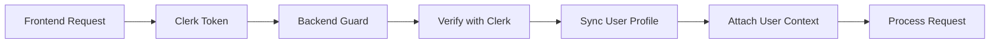

# Backend API Integration with RTK Query

## Overview

This document describes the backend API architecture optimized for RTK Query integration with best practices implementation.

## Architecture Highlights

### 1. **Standardized Response Format**
All API responses follow a consistent structure for optimal RTK Query caching:

```typescript
{
  success: boolean,
  data?: T,
  message?: string,
  error?: string,
  timestamp: string,
  path?: string
}
```

### 2. **Pagination Support**
Standardized pagination for all list endpoints:

```typescript
{
  data: T[],
  total: number,
  page: number,
  limit: number,
  totalPages: number
}
```

### 3. **Error Handling**
Global exception filter provides consistent error responses:
- Validation errors with field-level details
- HTTP status codes aligned with REST standards
- Detailed error messages for debugging

### 4. **Authentication Flow**



## API Endpoints Structure

### Authentication Endpoints
- `GET /api/auth/me` - Get current user profile
- `POST /api/auth/sync` - Sync user data from Clerk
- `GET /api/auth/permissions/:module` - Get module permissions
- `GET /api/auth/modules` - Get user accessible modules

### User Management
- `GET /api/users` - List users with pagination
- `GET /api/users/:id` - Get single user
- `POST /api/users` - Create user
- `PATCH /api/users/:id` - Update user
- `DELETE /api/users/:id` - Soft delete user

### Position & Role Management
- `GET /api/users/:id/positions` - Get user positions
- `POST /api/users/:id/positions` - Assign position
- `DELETE /api/users/:id/positions/:positionId` - Remove position
- `GET /api/users/:id/roles` - Get user roles
- `POST /api/users/:id/roles` - Assign role
- `DELETE /api/users/:id/roles/:roleId` - Remove role

## Best Practices Implementation

### 1. **DTOs for Type Safety**
All endpoints use Data Transfer Objects (DTOs) with validation:

```typescript
export class CreateUserDto {
  @IsString()
  @IsNotEmpty()
  clerkUserId: string;

  @IsString()
  @IsNotEmpty()
  nip: string;

  @IsOptional()
  @IsBoolean()
  isActive?: boolean = true;
}
```

### 2. **Guards for Security**
ClerkAuthGuard validates every request:
- Verifies JWT token with Clerk
- Syncs user profile automatically
- Attaches user context to request

### 3. **Interceptors for Consistency**
TransformInterceptor ensures all responses follow standard format:
- Wraps successful responses
- Adds metadata (timestamp, path)
- Maintains consistency for RTK Query

### 4. **Permission-Based Access Control**
Multi-level permission system:
- Superadmin override
- Role-based permissions
- Position-based permissions
- Module-specific access
- Scope-based filtering (OWN, DEPARTMENT, SCHOOL, ALL)

## RTK Query Optimization

### 1. **Cache Tags**
Backend supports RTK Query cache invalidation:
- Entity-based tags (User, Role, Position)
- List tags for pagination
- Relationship tags for nested data

### 2. **Optimistic Updates**
Response structure supports optimistic updates:
- Predictable response format
- Immediate feedback capability
- Rollback on errors

### 3. **Streaming & Real-time**
WebSocket support prepared for:
- Real-time notifications
- Live data updates
- Collaborative features

## Security Features

### 1. **Token Validation**
- Clerk JWT verification
- Token expiry handling
- Session management

### 2. **Rate Limiting**
- Configurable limits per endpoint
- IP-based throttling
- User-based quotas

### 3. **CORS Configuration**
- Whitelisted origins
- Credential support
- Preflight handling

### 4. **Input Validation**
- Class-validator decorators
- Type transformation
- Sanitization

## Performance Optimizations

### 1. **Database Queries**
- Efficient Prisma queries with includes
- Pagination at database level
- Index optimization

### 2. **Response Caching**
- ETags support ready
- Cache-Control headers
- Conditional requests

### 3. **Compression**
- Gzip/Deflate compression
- Threshold-based compression
- Content-type aware

## Error Handling Strategy

### 1. **Validation Errors** (400)
```json
{
  "success": false,
  "error": "ValidationError",
  "message": "Validation failed",
  "validationErrors": {
    "field": ["error message"]
  }
}
```

### 2. **Authentication Errors** (401)
```json
{
  "success": false,
  "error": "UnauthorizedException",
  "message": "Invalid or expired token"
}
```

### 3. **Authorization Errors** (403)
```json
{
  "success": false,
  "error": "ForbiddenException",
  "message": "Insufficient permissions"
}
```

### 4. **Not Found Errors** (404)
```json
{
  "success": false,
  "error": "NotFoundException",
  "message": "Resource not found"
}
```

## Frontend Integration Guide

### 1. **RTK Query Setup**
```typescript
// Base query with auth
baseQuery: fetchBaseQuery({
  baseUrl: API_URL,
  credentials: 'include',
  prepareHeaders: async (headers) => {
    const token = await getClerkToken();
    if (token) {
      headers.set('Authorization', `Bearer ${token}`);
    }
    return headers;
  },
})
```

### 2. **Cache Invalidation**
```typescript
// Automatic cache invalidation
invalidatesTags: (result, error, { id }) => [
  { type: 'User', id },
  { type: 'User', id: 'LIST' },
]
```

### 3. **Error Handling**
```typescript
try {
  const result = await mutation.unwrap();
  // Handle success
} catch (error) {
  if (error.status === 400) {
    // Handle validation errors
    const validationErrors = error.data.validationErrors;
  }
}
```

## Testing Integration

### 1. **E2E Testing**
- Postman collections provided
- Automated test suites
- Mock data generators

### 2. **Performance Testing**
- Load testing scenarios
- Response time benchmarks
- Concurrent user simulations

## Monitoring & Logging

### 1. **Request Logging**
- All requests logged with context
- Performance metrics tracked
- Error rates monitored

### 2. **Audit Trail**
- User actions recorded
- Data changes tracked
- Security events logged

## Environment Configuration

### Required Environment Variables
```env
# Clerk Authentication
CLERK_SECRET_KEY=sk_...
CLERK_PUBLISHABLE_KEY=pk_...
CLERK_WEBHOOK_SECRET=whsec_...

# Database
DATABASE_URL=postgresql://...

# API Configuration
API_PREFIX=api
PORT=3001
HOST=0.0.0.0

# CORS
CORS_ORIGINS=http://localhost:3000,https://yourdomain.com

# Rate Limiting
RATE_LIMIT_TTL=60
RATE_LIMIT_MAX=100

# Security
COOKIE_SECRET=your-secret-key
```

## Development Workflow

### 1. **Adding New Endpoints**
1. Create DTO with validation
2. Add controller method with guard
3. Implement service logic
4. Add RTK Query endpoint
5. Test with Postman/Thunder Client

### 2. **Database Changes**
1. Update Prisma schema
2. Create migration
3. Generate Prisma client
4. Update DTOs and services

### 3. **Permission Updates**
1. Define new permissions in schema
2. Update guard logic
3. Test permission flows
4. Update frontend checks

## Best Practices Checklist

✅ **API Design**
- RESTful conventions
- Consistent naming
- Proper HTTP methods
- Status codes

✅ **Security**
- Authentication on all endpoints
- Permission checks
- Input validation
- SQL injection prevention

✅ **Performance**
- Efficient queries
- Response pagination
- Caching strategy
- Compression

✅ **Documentation**
- OpenAPI/Swagger specs
- Postman collections
- Code comments
- README files

✅ **Testing**
- Unit tests
- Integration tests
- E2E tests
- Performance tests

## Troubleshooting

### Common Issues

1. **Token Verification Fails**
   - Check CLERK_SECRET_KEY
   - Verify token format
   - Check token expiry

2. **CORS Errors**
   - Verify CORS_ORIGINS
   - Check credentials flag
   - Validate headers

3. **Database Connection**
   - Check DATABASE_URL
   - Verify network access
   - Check connection pool

4. **Performance Issues**
   - Enable query logging
   - Check N+1 queries
   - Review indexes
   - Monitor memory usage