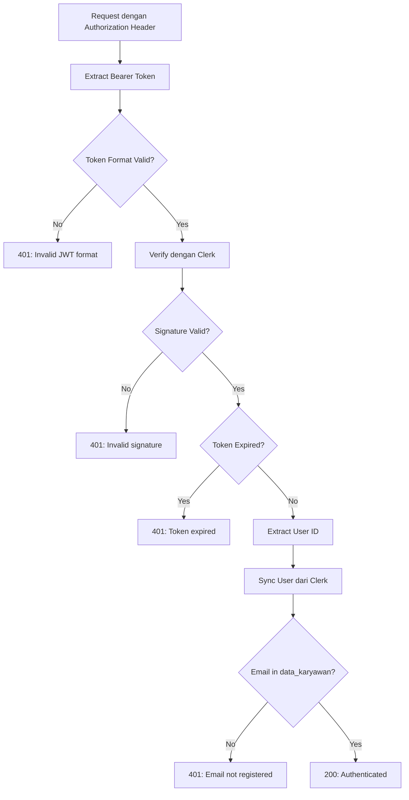

# 🔐 Clerk Authentication Guide for My Gloria Backend

## 📋 Mengapa "test-token" Tidak Bekerja?

### ❌ Token Invalid: "test-token"
```
Token: "test-token"
Format: Plain string (bukan JWT)
```

**Alasan gagal:**
1. **Bukan JWT Format** - JWT harus memiliki 3 bagian: `header.payload.signature`
2. **Tidak di-sign oleh Clerk** - Harus ditandatangani dengan secret key Anda
3. **Tidak ada claims** - Tidak mengandung user_id, session_id, exp, dll

### ✅ Token Valid dari Clerk
```
Token: eyJhbGciOiJSUzI1NiIsInR5cCI6IkpXVCJ9.eyJzdWIiOiJ1c2VyXzMxSjlkVUlVQTZ2aEJYRlJYa3NQZzRzemNpbSIsImV4cCI6MTcwMDAwMDAwMH0.signature
Format: JWT (header.payload.signature)
```

**Struktur JWT yang valid:**

#### Header
```json
{
  "alg": "RS256",
  "typ": "JWT",
  "kid": "ins_2abc..."
}
```

#### Payload (Claims)
```json
{
  "azp": "https://prepared-rodent-52.clerk.accounts.dev",
  "exp": 1700000000,  // Expiration time
  "iat": 1699996400,  // Issued at
  "iss": "https://prepared-rodent-52.clerk.accounts.dev",
  "nbf": 1699996370,  // Not before
  "sid": "sess_2abc...",  // Session ID
  "sub": "user_31J9dUIUA6vhBXFRXksPg4szcim"  // User ID
}
```

#### Signature
- 256-bit RS256 signature
- Ditandatangani dengan Clerk secret key
- Tidak bisa dipalsukan

## 🚀 Cara Mendapatkan Token Valid

### Opsi 1: Gunakan HTML Test Page (Recommended)
```bash
# 1. Buka file HTML di browser
open get-clerk-token.html

# 2. Sign in dengan akun Clerk Anda
# 3. Copy token yang ditampilkan
# 4. Gunakan dalam API calls
```

### Opsi 2: Gunakan Script Tester
```bash
# Jalankan script untuk memahami token requirements
node get-valid-clerk-token.js

# Test API dengan token
node test-api-auth.js
```

### Opsi 3: Frontend Integration
```javascript
// React Example
import { useAuth } from '@clerk/nextjs';

function MyComponent() {
  const { getToken } = useAuth();
  
  const callAPI = async () => {
    const token = await getToken();
    
    const response = await fetch('http://localhost:3001/api/auth/me', {
      headers: {
        'Authorization': `Bearer ${token}`
      }
    });
    
    const data = await response.json();
    console.log(data);
  };
}
```

## 🔍 Backend Validation Flow

Ketika backend menerima request dengan token:



## 🧪 Testing Commands

### 1. Check Clerk Connection
```bash
node test-clerk-connection.js
```

### 2. Test with Invalid Token (akan gagal)
```bash
curl -X GET http://localhost:3001/api/auth/me \
  -H "Authorization: Bearer test-token" \
  -H "Content-Type: application/json"

# Response: 401 Unauthorized
# Reason: "Invalid JWT format"
```

### 3. Test with Valid Token (akan berhasil)
```bash
# Get token dari get-clerk-token.html dulu, lalu:
curl -X GET http://localhost:3001/api/auth/me \
  -H "Authorization: Bearer eyJhbGc..." \
  -H "Content-Type: application/json"

# Response: 200 OK
# Body: User profile data
```

## 📌 Key Points

1. **Anda TIDAK BISA membuat fake token** - Harus dari Clerk
2. **Token harus dalam format JWT** - 3 bagian dipisah titik
3. **Token harus di-sign oleh Clerk** - Dengan secret key Anda
4. **Token harus memiliki claims valid** - sub, exp, iat, iss
5. **User email harus ada di data_karyawan** - Untuk validasi tambahan

## 🛠️ Troubleshooting

### Error: "Invalid JWT format"
- **Cause**: Token bukan JWT (seperti "test-token")
- **Fix**: Gunakan token dari Clerk setelah sign in

### Error: "Token verification failed"
- **Cause**: Token tidak di-sign oleh Clerk Anda
- **Fix**: Pastikan token dari instance Clerk yang sama

### Error: "Token has expired"
- **Cause**: Token sudah kadaluarsa
- **Fix**: Sign in ulang untuk mendapat token baru

### Error: "Email not registered"
- **Cause**: Email user tidak ada di data_karyawan
- **Fix**: Tambahkan email ke database atau gunakan email yang terdaftar

## 📚 Resources

- [Clerk Documentation](https://clerk.com/docs)
- [JWT.io - JWT Debugger](https://jwt.io)
- Backend Auth Guard: `src/auth/guards/clerk-auth.guard.ts`
- Auth Service: `src/auth/auth.service.ts`