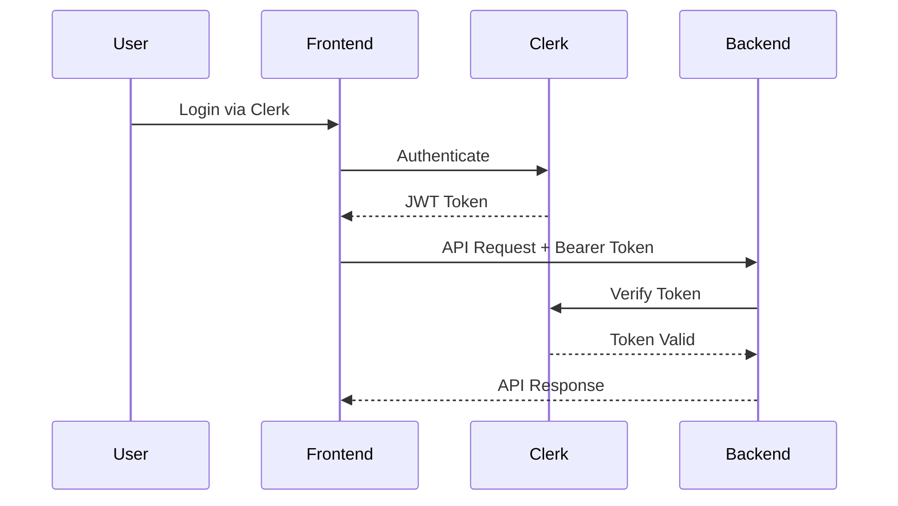

# Clerk Authentication Integration Guide

## Overview
This guide ensures proper authentication integration between the Next.js frontend and NestJS backend using Clerk.

## Frontend-Backend Authentication Flow



## Frontend Setup ✅

### 1. Environment Variables
```env
# .env.local
NEXT_PUBLIC_CLERK_PUBLISHABLE_KEY=pk_test_xxx
CLERK_SECRET_KEY=sk_test_xxx
NEXT_PUBLIC_API_URL=http://localhost:3001/api
```

### 2. Token Retrieval (Already Implemented)
- **Location**: `/src/lib/auth/clerkClient.ts`
- **Base Query**: `/src/store/api/clerkBaseQueryV2.ts`
- **Usage**: Automatically handles token attachment to all API requests

### 3. Key Files
- `src/store/api/apiSlice.ts` - Uses clerkBaseQueryV2
- `src/contexts/ImpersonationContext.tsx` - Handles auth errors gracefully
- `src/providers/AuthenticatedApiProvider.tsx` - Global token provider

## Backend Setup 🔧

### 1. Environment Variables
```env
# .env
CLERK_SECRET_KEY=sk_test_xxx
CLERK_PUBLISHABLE_KEY=pk_test_xxx
```

### 2. Install Required Packages
```bash
cd backend
npm install @clerk/clerk-sdk-node
```

### 3. Clerk Auth Guard Configuration

The `ClerkAuthGuard` at `src/auth/guards/clerk-auth.guard.ts` handles:
- Bearer token extraction from Authorization header
- Token verification with Clerk
- User synchronization
- Circuit breaker for resilience

### 4. Common Issues & Solutions

#### Issue: 401 Unauthorized Error
**Symptoms**: 
- Frontend receives 401 errors
- "Token verification failed: fetch failed" in backend logs

**Solutions**:
1. **Verify Environment Variables**:
   ```bash
   # Backend
   echo $CLERK_SECRET_KEY  # Should start with sk_test_ or sk_live_
   echo $CLERK_PUBLISHABLE_KEY  # Should start with pk_test_ or pk_live_
   ```

2. **Check Token Format**:
   - Frontend should send: `Authorization: Bearer <jwt_token>`
   - Token should be a valid JWT (3 parts separated by dots)

3. **Verify Clerk Domain**:
   - The issuer domain must match your Clerk instance
   - Default: `https://prepared-rodent-52.clerk.accounts.dev`
   - Check your Clerk dashboard for the correct domain

4. **Test Token Manually**:
   ```javascript
   // In browser console
   const clerk = window.Clerk;
   const token = await clerk.session.getToken();
   console.log('Token:', token);
   
   // Test API call
   fetch('http://localhost:3001/api/v1/admin/impersonation/session', {
     headers: {
       'Authorization': `Bearer ${token}`
     }
   }).then(r => r.json()).then(console.log);
   ```

#### Issue: Circuit Breaker Open
**Symptoms**: 
- "Authentication service temporarily unavailable"
- Multiple consecutive failures

**Solution**:
- Wait 1 minute for circuit breaker to reset
- Check Clerk service status
- Verify network connectivity to Clerk

## Best Practices Implementation ✅

### 1. Token Management
- ✅ Centralized token retrieval (`/src/lib/auth/clerkClient.ts`)
- ✅ Automatic token refresh (handled by Clerk SDK)
- ✅ Token attached to all API requests
- ✅ Graceful error handling for missing tokens

### 2. Error Handling
- ✅ Different handling for 401, 404, 501 errors
- ✅ User-friendly error messages
- ✅ Automatic retry with exponential backoff
- ✅ Circuit breaker pattern for resilience

### 3. Security
- ✅ Tokens never logged in production
- ✅ HTTPS enforced in production
- ✅ Secure token storage (handled by Clerk)
- ✅ Token expiry validation

### 4. Performance
- ✅ Token caching to avoid repeated fetches
- ✅ Parallel request optimization
- ✅ Polling interval for session checks (30s)
- ✅ Conditional refetch based on auth status

## Testing Authentication

### 1. Frontend Token Test
```typescript
// Create test component
import { useAuth } from '@clerk/nextjs';

function TestAuth() {
  const { getToken } = useAuth();
  
  const testToken = async () => {
    const token = await getToken();
    console.log('Token obtained:', !!token);
    
    // Test API call
    const response = await fetch('/api/test', {
      headers: {
        'Authorization': `Bearer ${token}`
      }
    });
    console.log('API Response:', response.status);
  };
  
  return <button onClick={testToken}>Test Auth</button>;
}
```

### 2. Backend Token Verification Test
```typescript
// In backend controller
@Get('test-auth')
@UseGuards(ClerkAuthGuard)
async testAuth(@Req() req) {
  return {
    success: true,
    userId: req.auth.userId,
    user: req.user
  };
}
```

## Deployment Checklist

### Frontend
- [ ] Set production Clerk keys in Vercel/hosting environment
- [ ] Update NEXT_PUBLIC_API_URL to production backend URL
- [ ] Enable HTTPS
- [ ] Test authentication flow in production

### Backend
- [ ] Set production Clerk keys in environment
- [ ] Configure CORS for frontend domain
- [ ] Enable HTTPS
- [ ] Monitor authentication errors
- [ ] Set up error alerting

## Monitoring

### Key Metrics to Track
1. **Authentication Success Rate**
   - Target: > 99%
   - Alert threshold: < 95%

2. **Token Verification Latency**
   - Target: < 200ms
   - Alert threshold: > 500ms

3. **Circuit Breaker Trips**
   - Target: 0
   - Alert on any trip

4. **401 Error Rate**
   - Target: < 0.1%
   - Alert threshold: > 1%

## Support

If authentication issues persist:
1. Check Clerk dashboard for service status
2. Verify all environment variables are set correctly
3. Check network connectivity between services
4. Review backend logs for detailed error messages
5. Test with Clerk's debug mode enabled