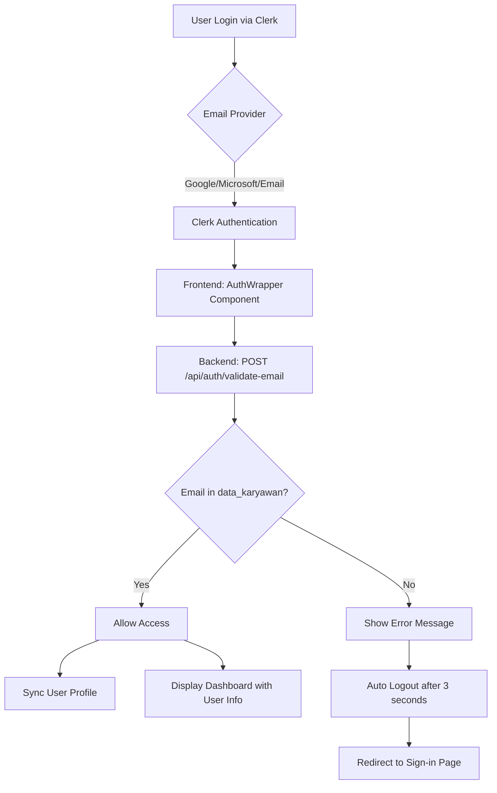

# Email Validation and Authentication Flow

## Overview

This document describes the enhanced authentication flow that validates user emails against the `data_karyawan` table to ensure only registered employees can access the system.

## Authentication Flow Diagram



## Implementation Components

### 1. Backend Email Validation

#### Endpoint: `/api/auth/validate-email`
- **Method**: POST
- **Public Access**: Yes (no authentication required for validation)
- **Purpose**: Check if email exists in `data_karyawan` table

**Request**:
```json
{
  "email": "user@example.com"
}
```

**Response (Valid)**:
```json
{
  "valid": true,
  "message": "Email is registered",
  "employee": {
    "nip": "123456",
    "nama": "John Doe"
  }
}
```

**Response (Invalid)**:
```json
{
  "valid": false,
  "message": "Email not registered in employee database. Please contact administrator."
}
```

### 2. Backend Service Methods

#### `validateUserEmail(email: string)`
- Checks if email exists in `data_karyawan` table
- Case-insensitive comparison
- Returns boolean

#### `getEmployeeByEmail(email: string)`
- Retrieves employee data by email
- Returns NIP, nama, and other basic info
- Used for dashboard display

#### `syncUserFromClerk(clerkUserId: string)`
- Enhanced to validate email before creating user profile
- Throws `UnauthorizedException` if email not found
- Automatically links Clerk user to employee data

### 3. Frontend AuthWrapper Component

**Location**: `/src/components/AuthWrapper.tsx`

**Features**:
- Validates user email immediately after sign-in
- Shows loading state during validation
- Auto-logout for unregistered emails
- Stores employee info in localStorage for quick access
- Shows error notification before logout

**Flow**:
1. User signs in via Clerk
2. AuthWrapper validates email with backend
3. If valid: Allow access and store employee info
4. If invalid: Show error, wait 3 seconds, then logout

### 4. Dashboard User Info Display

**Component**: `UserInfoCard`
**Location**: `/src/app/dashboard/UserInfoCard.tsx`

**Displays**:
- Full Name (nama)
- NIP
- Email
- Phone Number
- Department (bagianKerja)
- Location (lokasi)
- Position (bidangKerja)
- Superadmin badge (if applicable)

### 5. Clerk Webhook Integration

**Enhanced webhook handlers**:
- `handleUserCreated`: Validates email before syncing
- Logs warning for unregistered emails
- Option to auto-delete invalid Clerk users

## Security Features

### 1. **Multi-Layer Validation**
- Frontend validation (immediate feedback)
- Backend validation (authoritative check)
- Webhook validation (prevent invalid user creation)

### 2. **Automatic Cleanup**
- Auto-logout for invalid users
- Session termination
- Clear error messaging

### 3. **Audit Trail**
- Logs all validation attempts
- Tracks unauthorized access attempts
- Records user sync activities

## Error Handling

### User-Facing Messages
1. **Email Not Found**: "Your email is not registered in the employee database. Please contact administrator."
2. **Validation Error**: "Failed to validate user credentials. Please try again."
3. **No Email**: "No email address found"

### Auto-Logout Behavior
- 3-second delay after error display
- Clear notification to user
- Automatic redirect to sign-in page
- Session cleanup

## Best Practices Implemented

### 1. **Separation of Concerns**
- Validation logic in backend service
- UI feedback in frontend component
- Authentication handled by Clerk

### 2. **User Experience**
- Clear loading states
- Informative error messages
- Smooth transitions
- Employee info displayed prominently

### 3. **Performance**
- Email validation cached in localStorage
- Minimal API calls
- Efficient database queries

### 4. **Security**
- No sensitive data in frontend
- Validation at multiple checkpoints
- Proper error handling

## Configuration Requirements

### Environment Variables

**Backend (.env)**:
```env
DATABASE_URL=postgresql://...
CLERK_SECRET_KEY=sk_...
CLERK_PUBLISHABLE_KEY=pk_...
CLERK_WEBHOOK_SECRET=whsec_...
```

**Frontend (.env.local)**:
```env
NEXT_PUBLIC_API_URL=http://localhost:3001/api
NEXT_PUBLIC_CLERK_PUBLISHABLE_KEY=pk_...
```

### Database Requirements
- `data_karyawan` table must have email field populated
- Email should be unique per employee
- Case-insensitive email matching

## Testing Scenarios

### 1. **Valid Employee Login**
- User with email in `data_karyawan`
- Should access dashboard
- See their name and NIP

### 2. **Invalid Email Login**
- User with email NOT in `data_karyawan`
- Should see error message
- Auto-logout after 3 seconds
- Redirect to sign-in

### 3. **Employee Without Email**
- Employee record without email
- Fallback to NIP-based validation
- Metadata checking

### 4. **Network Failure**
- Validation endpoint unreachable
- Show error and logout
- Graceful degradation

## Monitoring & Logging

### Backend Logs
```typescript
// Successful validation
logger.log(`Email validated successfully: ${email}`);

// Failed validation
logger.warn(`Email validation failed for: ${email}`);

// User sync
logger.log(`Created new user profile for ${clerkUserId} with NIP: ${nip}`);
```

### Frontend Tracking
- Validation attempts
- Success/failure rates
- Auto-logout triggers
- User experience metrics

## Future Enhancements

1. **Email Whitelist Management**
   - Admin interface for email management
   - Bulk email import
   - Email pattern matching

2. **Grace Period**
   - Temporary access for new employees
   - Pending approval system
   - Email verification workflow

3. **Enhanced Notifications**
   - Email notifications to admin
   - Slack integration for alerts
   - Dashboard for access attempts

4. **Role-Based Validation**
   - Different validation rules per role
   - Department-specific access
   - Time-based access control

## Troubleshooting

### Common Issues

1. **User can't login despite valid email**
   - Check email case sensitivity
   - Verify email in `data_karyawan`
   - Check Clerk user metadata

2. **Auto-logout not working**
   - Verify AuthWrapper is wrapping app
   - Check Redux store integration
   - Verify Clerk signOut method

3. **Employee info not displaying**
   - Check localStorage for employeeInfo
   - Verify API response format
   - Check UserInfoCard component

4. **Validation endpoint failing**
   - Check CORS configuration
   - Verify API URL in frontend
   - Check network connectivity